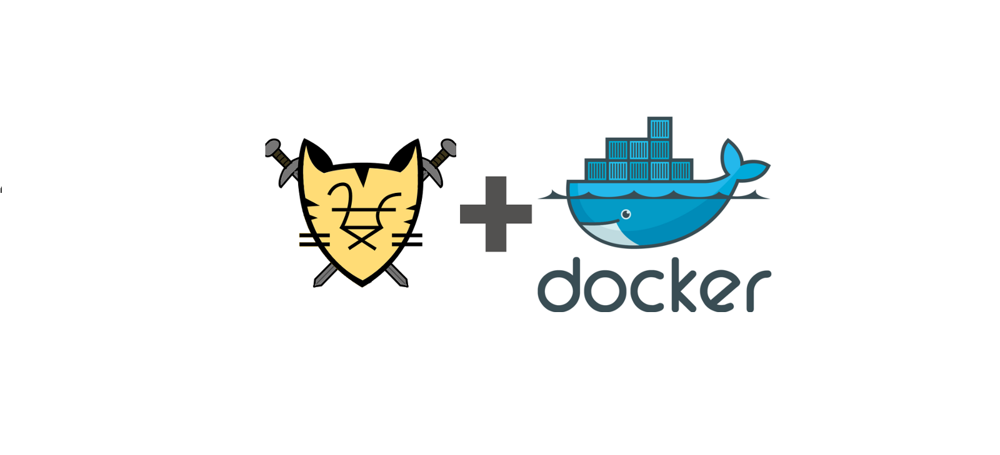

# 01 exemplos de Images docker File ultilizando Tomcat

## Dockerfile
Neste diretorio temos um imagem com Docker File

```bash
$ cd docker_file_tomcat
$ docker build -t "Nome da Imagem e tag" .
```

# 02 exemplos de Images com tomcat

## compose
Neste diretorio temos um imagem com Docker File e deployment compose

```bash
$ cd compose
$ docker-compose up -d
```